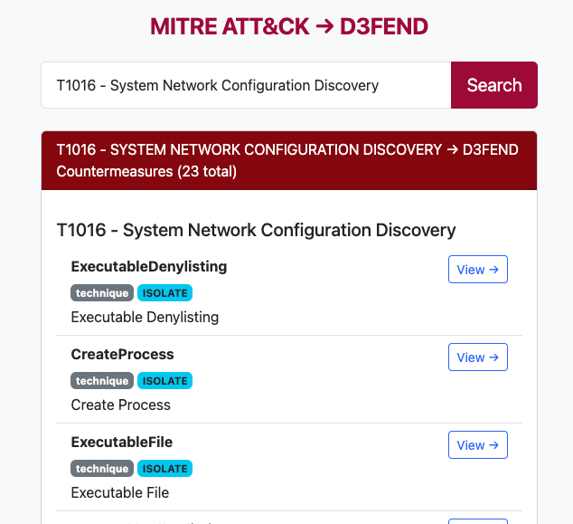

<p align="center">
  
  <br>
  <em><strong>Because knowing your defenses is the new offense.</strong></em>
</p>


# D3fendConvert

D3fendConvert is a small, fast reference web app for mapping MITRE ATT&CK techniques to D3FEND countermeasures. It's designed to let defenders, analysts, and engineers quickly search for D3FEND coverage for an ATT&CK technique (for example, `T1566.001`) and get concise results for planning and investigation.

<p align="center">
 
  <br><br>
</p>
## Quick highlights

- Fast search UI and JSON API for programmatic use
- Uses MITRE's D3FEND ↔ ATT&CK mappings (downloaded at startup when needed)
- Small, dependency-light Python/Flask app intended as a reference tool

## Table of contents

- Features
- Tech stack
- Getting started (local)
- Configuration
- Running in production
- API endpoints and examples
- Security notes
- Contributing
- License

## Features

- Search by ATT&CK ID or name to find related D3FEND techniques and artifacts
- Lightweight JSON API for automation and integrations
- Rate limiting and security headers (Talisman + Flask-Limiter) configured

## Tech stack

- Python 3.8+ (works with 3.8/3.9/3.10/3.11)
- Flask - web framework
- flask-talisman - security headers (CSP, HSTS when enabled)
- flask-limiter - simple rate limiting
- requests - HTTP for downloading the mappings file
- markupsafe - HTML-escaping for safe output
- Frontend: small static JS and a single `index.html` template (Bootstrap CDN for styling)

Files of interest

- `app.py` – main Flask app and search logic
- `mappings.json` – (optional) cached copy of the D3FEND↔ATT&CK mappings
- `static/` – frontend JS
- `templates/index.html` – main UI
- `requirements.txt` – Python dependencies

## Getting started (local development)

### Prerequisites

- Python 3.8 or newer
- Git

### 1) Clone the repo

```bash
git clone https://github.com/your-user/D3tectConvert.git
cd D3tectConvert
```

### 2) Create and activate a virtual environment

```bash
python3 -m venv .venv
source .venv/bin/activate
```

### 3) Install dependencies

```bash
pip install -r requirements.txt
```

### 4) (Optional) Add a `.env` for development

This project intentionally does not contain secrets in source. If you want signed sessions or other features that depend on Flask's `SECRET_KEY`, create a local `.env` file (the repo's `.gitignore` already ignores `.env`) and add:

```env
SECRET_KEY=your-dev-secret
FLASK_DEBUG=1
PORT=5000
```

Generate a secure secret locally if you need one:

```bash
python -c "import secrets; print(secrets.token_urlsafe(64))"
```

### 5) Run the app (development)

```bash
FLASK_DEBUG=1 PORT=5000 python3 app.py
```

Open `http://localhost:5000` in your browser.

#### Notes about mappings

The app will try to load `mappings.json` at startup. If the file is missing it will download a fresh copy from MITRE (the first run may take a minute and a few tens of MB). To force a download, set:

```bash
TD3_FORCE_DOWNLOAD=1 python3 app.py
```

## Configuration (environment variables)

- `FLASK_DEBUG` - set to `1` for development mode (disables HSTS/Talisman to avoid localhost issues)
- `PORT` - port the server listens on (default 5000)
- `TD3_FORCE_DOWNLOAD` - set to `1` to force re-download of the mappings file at startup
- `SECRET_KEY` - optional; set for session signing or other features that require a secret. The project intentionally contains no secrets in source.

## Running in production

This project is simple to run behind a WSGI server such as Gunicorn.

Install gunicorn (if not already):

```bash
pip install gunicorn
```

Run with multiple workers:

```bash
gunicorn -w 4 -b 0.0.0.0:${PORT:-8000} app:app
```

The included `Procfile` (for Heroku-style platforms) can be used or adapted as needed.

## API endpoints & examples

- `/` - UI
- `/search?q=<query>` - JSON search endpoint. Query can be an ATT&CK ID (e.g., `T1566.001`) or free text.
- `/api/attacks?q=<filter>&limit=<n>` - list of attack ids + names (JSON)

Examples (curl)

```bash
curl "http://localhost:5000/search?q=T1566.001"

curl "http://localhost:5000/api/attacks?limit=10"
```

## Security notes

- This repository intentionally contains no embedded secrets. Do not commit a `SECRET_KEY` or other secrets into the repository. Use environment variables or a secret manager for production.
- The app uses `flask-talisman` to add security headers (CSP/HSTS) unless `FLASK_DEBUG=1` (development) to avoid HSTS on localhost.
- Rate limiting is provided by `flask-limiter` to reduce abuse.

## Contributing

Contributions are welcome. If you want to improve the UI, add features, or wire this app to a hosted D3FEND mirror, please open an issue or a pull request. A few low-risk ideas:

- Add automated tests for the mapping loader and search behavior
- Add a small caching layer for mappings or search results
- Add integration tests for the JSON API

When contributing, please avoid committing secrets and run `flake8`/formatting on your changes if applicable.

## License

This project is provided under the terms of the existing `LICENSE` file in the repository.

---

If you'd like, I can also add a short `docs/DEPLOY.md` that includes example commands for Heroku, Docker, and systemd, or add python-dotenv support for local development. Which would you prefer next?
<p align="center">
  
  <br>
  <em><strong>Because knowing your defenses is the new offense.</strong></em>
</p>


